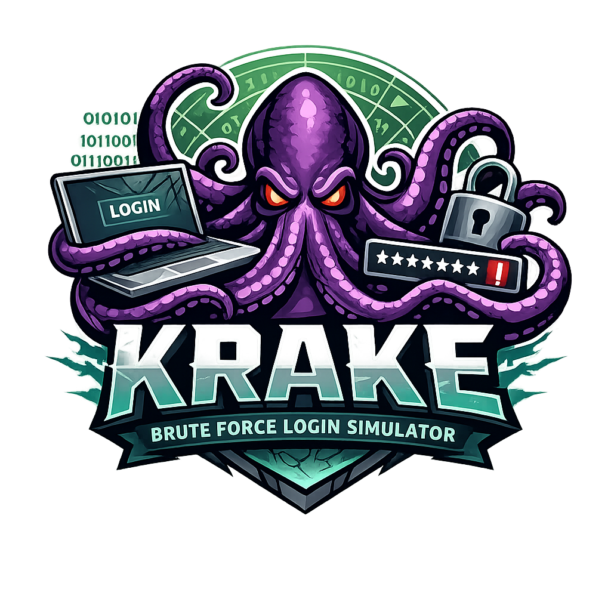

# 🔐 Brute Force Login Simulator

An educational cybersecurity project that simulates brute force login attacks in a controlled environment to demonstrate authentication vulnerabilities and defense mechanisms.

⚠️ This project is intended strictly for educational and ethical learning purposes.

## 📌 Overview

The Brute Force Login Simulator helps students and cybersecurity enthusiasts understand:

- How brute force password attacks work
- Why weak passwords are dangerous
- How authentication systems fail
- How security controls mitigate attacks
- The importance of password hashing and rate limiting

This simulator does NOT attack real systems and should only be used in controlled environments.

## 🎯 Features

### 🔓 Attack Simulation
- Dictionary-based brute force attacks
- Single-user and multi-user attack modes
- Optional multi-threaded execution
- Real-time attack progress
- Detailed success and failure statistics

### 🛡️ Security Mechanisms (Configurable)
- Account lockout after failed attempts
- Rate limiting between login attempts
- Password hashing using SHA-256
- Optional CAPTCHA and 2FA simulation
- Attack logging for auditing

### 🖥️ User Interface
- Interactive command-line interface
- Step-by-step attack visualization
- Simple and beginner-friendly menu

## 📁 Project Structure

### Directory Layout

brute-force-simulator/
- main.py
- config.py
- users.json
- passwords.txt
- attack_logs.txt
- README.md

### Project Structure Table

| File Name         | Description |
|------------------|-------------|
| main.py           | Main application logic and CLI |
| config.py         | Attack and security configuration |
| assets/picture.png| logo for project |
| users.json        | Simulated user database |
| passwords.txt     | Password dictionary |
| attack_logs.txt   | Logs of attack attempts |
| README.md         | Project documentation |

## 🛠️ Installation

### Step 1: Clone the Repository
git clone <repository-url>
cd brute-force-simulator

### Step 2: Verify Python Version
python --version

Python 3.6 or higher is required.  
No external libraries are needed.

## ⚙️ Configuration

Modify config.py to adjust attack and security behavior:

MAX_ATTEMPTS = 100
LOCKOUT_TIME = 30
RATE_LIMIT_DELAY = 0

MAX_THREADS = 1
TIMEOUT = 5
LOG_LEVEL = "INFO"

ENABLE_CAPTCHA = False
ENABLE_2FA = False
HASH_PASSWORDS = False

## 🚀 Usage

Run the simulator using:
python main.py

### Menu Options
1. Attack single user
2. Attack all users
3. Exit

## 🧪 Example Output

BRUTE FORCE SIMULATOR
====================

Loaded Users: 4
Loaded Passwords: 7

ATTACKING USER: admin
--------------------
Trying password 1/7: admin123
SUCCESS! Password found

Time Taken: 0.30 seconds
Attempts: 1

## 🔐 Default Credentials (Demo)

| Username   | Password        | Role |
|-----------|-----------------|------|
| admin      | admin123        | Admin |
| john_doe   | password123     | User |
| jane_smith | securePass!2024 | User |
| test_user  | test            | User |

## 📖 Password Dictionary

The passwords.txt file contains common passwords such as:

admin123
password123
securePass!2024
test
123456
password
qwerty

## 📊 Logging

All attack attempts are stored in attack_logs.txt as an example:

[2026-02-10 23:31:55] INFO: Attack started on admin
[2026-02-10 23:31:56] SUCCESS: Password cracked

## 🧩 Customization

### Add New Users
Edit users.json and add:

{
  "username": "new_user",
  "password": "new_password",
  "role": "user",
  "failed_attempts": 0,
  "account_locked": false
}

### Expand Password Dictionary
Add one password per line in passwords.txt.

## 🛡️ Security Considerations

This project is for educational use only.

- Do not use against real systems
- Always obtain proper authorization
- Follow ethical hacking guidelines

### Best Practices Demonstrated
- Strong password policies
- Account lockout mechanisms
- Rate limiting
- Password hashing
- Security logging

## 📈 Learning Outcomes

You will learn:
- How brute force attacks operate
- Why weak passwords fail
- How defenses slow attackers
- Real-world authentication weaknesses

## ⚠️ Disclaimer

Unauthorized access to computer systems is illegal.

This project is intended strictly for educational purposes.
The author is not responsible for misuse.

Hack ethically. Learn responsibly.
